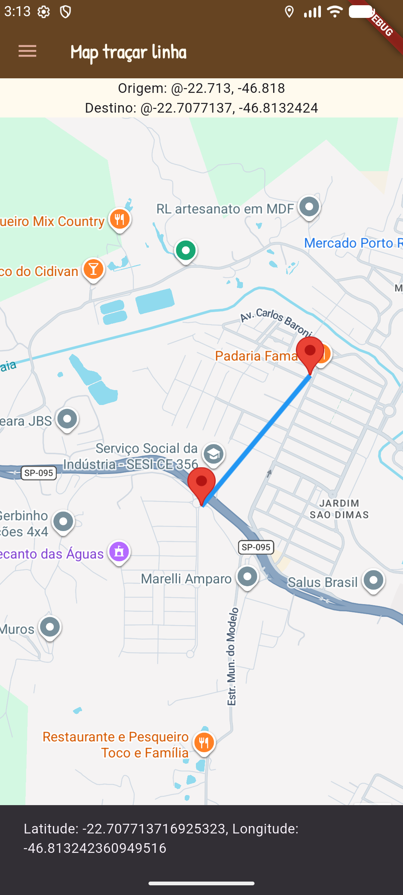
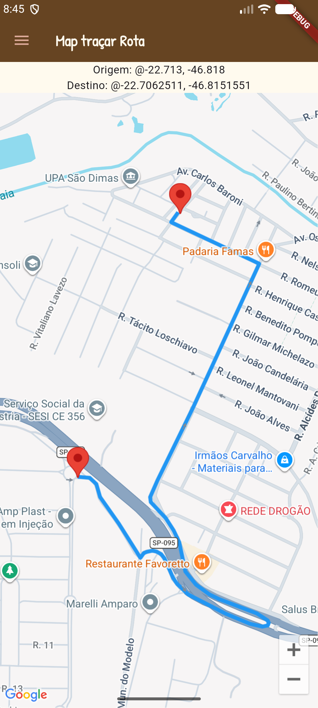

# flutter_maps_tracar_trajeto
App de estdos com Google Maps e Polyline, com o objetivo de traçar trajetos no mapa
- Menu como widget
- style - tema claro e escuro pelo sistema
- Splash com animação

## Tecnologias
- Flutter
- Android Studio
- API Google Maps
- VsCode

## Como testar
- Clone o repositório
- Abra com vscode
- Insira uma **chave de API do Google Maps** no arquivo `android/app/src/main/AndroidManiest.xml`
  - Também insira em `lib/ui/rota.dart` no local indicado
- Instale as dependências e execute em um emulador
```bash
flutter pub get
fltutter run
```

## Screenshots
|||
|-|-|
|||
